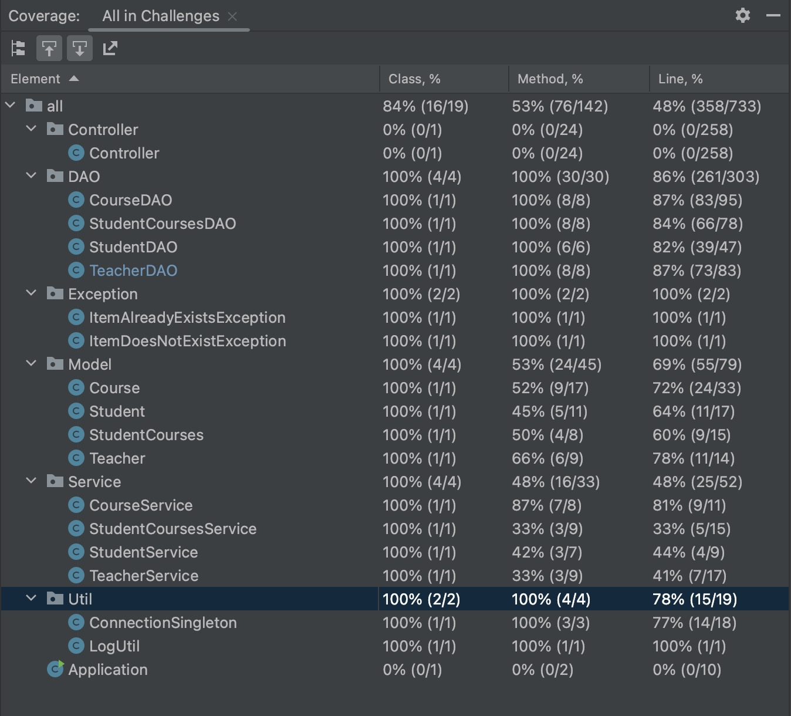

# Read Me

<details>
  <summary>Table of Contents</summary>
  <ol>
    <li>
      <a href="#about-the-project">About The Project</a>
      <ul>
        <li><a href="#User-Stories">User Stories</a></li>
        <li><a href="#built-with">Used technology</a></li>
      </ul>
    </li>
    <li><a href="#roadmap">Roadmap</a></li>
     <li><a href="#Implementation">Implementation</a>
<ul> <li><a href="#Database">Database</a></li>
     <li>Java code</li>
     <li><a href="#Available-Endpoints">Endpoints</a>
       <ul>
         <li><a href='#Courses-endpoints'>Courses endpoints</a></li>
         <li><a href='#Students-endpoints'>Students endpoints</a></li>
         <li><a href='#Teacher-endpoints'>Teacher endpoints</a></li>
       </ul>
     </li>
     <li>Tests</li>
</ul>
</li>
  </ol>
</details>

## User Stories

- Teachers can look up which student is in a particular class
- Student can find which courses they are taking are from a particular teacher.
- Be able to loop up which courses a teacher is teaching
- Students should be able to register/unregister for a course
- Be able to add new students, courses, and teachers
- Be able to delete existing students, courses, and teachers
- Be able to update existing new students, courses, and teachers

## Coverage Results



## Database

<p align="right">(<a href="#top">back to top</a>)</p>

## ER Diagram


[JavaDocs link](JavaDocs/index.html)

## Available Endpoints

### Courses endpoints 

----------------
#### Get all of the courses

<p align="right">(<a href="#top">back to top</a>)</p>

###### Request
```GET /course```

###### Response
Status code will always return a 200 with a similar body.
```json
[
  {
    "id": 1,
    "subject": "MATH",
    "number": 15000,
    "title": "Number Systems",
    "creditHours": 4.0,
    "teacherId": 1
  },
  {
    "id": 2,
    "subject": "BIOL",
    "number": 12300,
    "title": "Biology 101",
    "creditHours": 4.0,
    "teacherId": 1
  },
  ...
]
```
----------------
#### Add a new course

<p align="right">(<a href="#top">back to top</a>)</p>

###### Request
```POST /course```

Body:
```json
{
  "id": 100,
  "subject": "MATH",
  "number": 32800,
  "title": "Metric and Topological Spaces",
  "creditHours": 4.0,
  "teacherId": 1
}
```

###### Response
If successful a status code of 200 will be returned with the following body.
```Successfully added course!```

Errors
- If the course id that was sent is already in use then a status code of 400 is returned with the following body.
```Exception.ItemAlreadyExistsException: Course already exists```
- If the teacher id that was send with the course does not exist in the database then a status code of 404 is returned with the following body.
```Exception.ItemDoesNotExistException: Teacher does not exist```
- If the body is not in the correct JSON format for a course then a status code of 400 is returned with the following body.
```Invalid JSON data in the request body.```

----------------
#### Update an existing course

<p align="right">(<a href="#top">back to top</a>)</p>

###### Request
```PUT /course```

Body:
```json
{
  "id": 25,
  "subject": "PHYS",
  "number": 30400,
  "title": "Special Relativity",
  "creditHours": 4.0,
  "teacherId": 18
}
```

###### Response
Status code will return a 200 with the following body.
```Successfully updated course!```

Errors
- If the course id that was sent is not in use then a status code of 404 is returned with the following body.
```Exception.ItemDoesNotExistException: Course does not exist```
- If the teacher id that was send with the course does not exist in the database then a status code of 404 is returned with the following body.
```Exception.ItemDoesNotExistException: Teacher does not exist```
- If the body is not in the correct JSON format for a course then a status code of 400 is returned with the following body.
```Invalid JSON data in the request body.```

----------------
#### Delete an existing course

<p align="right">(<a href="#top">back to top</a>)</p>

###### Request
```DELETE /course/{course_id}```

###### Response
If successful a status code of 200 will be returned with the following body.
```Successfully deleted course!```

Errors
- If the course id that was sent is not in use then a status code of 404 is returned with the following body.
```Exception.ItemDoesNotExistException: Course does not exist```
- If the course_id is not parsable as an integer then a status code of 400 is returned with a similar body as below.
```Invalid input: {course_id) is not an integer!```

----------------
#### Get a course by its id

<p align="right">(<a href="#top">back to top</a>)</p>

###### Request
```GET /course/{course_id}```

###### Response

If successful a status code of 200 will be returned with a similar body for the specific course requested.
```json
{
  "id": 45,
  "subject": "CHEM",
  "number": 34200,
  "title": "Organic Chemistry II",
  "creditHours": 4.0,
  "teacherId": 25
}
```

Errors
- If no such course with the requested id exists then the request is unsuccessful and a status code of 404 will be returned with the following body.
```Exception.ItemDoesNotExistException: Course does not exist```
- If the course_id is not parsable as an integer then a status code of 400 is returned with a similar body as below.
```Invalid input: {course_id) is not an integer!```

----------------
#### Get all of the courses that a teacher is teaching

<p align="right">(<a href="#top">back to top</a>)</p>

###### Request
```GET /course/teacher/{teacher_id}```

###### Response
If the teacher_id that was given is an integer then the response will always return a 200 status code. If there exists a teacher whose id is associated with a course(s) then a similar body as below will be returned.
```json
[
  {
    "id": 55,
    "subject": "CS",
    "number": 17500,
    "title": "C/C++ Programming",
    "creditHours": 4.0,
    "teacherId": 14
  },
  {
    "id": 64,
    "subject": "CS",
    "number": 45000,
    "title": "Principles of Software Engineering",
    "creditHours": 4.0,
    "teacherId": 14
  },
  ...
]
```
Else, an empty array will be returned in the body.
```json
[]
```

Errors
- If the teacher_id is not parsable as an integer then a status code of 400 is returned with a similar body as below.
```Invalid input: {teacher_id) is not an integer!```

----------------
#### Get all of the courses that a student is taking

<p align="right">(<a href="#top">back to top</a>)</p>

###### Request
```GET /course/student/{student_id}```

###### Response
If the student_id that was given is an integer then the response will always return a 200 status code. If there exists a student with the provided id and that student is associated with some courses then a similar body as below will be returned. 
```json
[
  {
    "id": 2,
    "subject": "BIOL",
    "number": 12300,
    "title": "Biology 101",
    "creditHours": 4.0,
    "teacherId": 1
  },
  {
    "id": 5,
    "subject": "ENG",
    "number": 20400,
    "title": "Introduction to Fiction",
    "creditHours": 3.0,
    "teacherId": 3
  },
  ...
]
```
Else, an empty array will be returned in the body.
```json
[]
```

Errors
- If the student_id is not parsable as an integer then a status code of 400 is returned with a similar body as below.
```Invalid input: {student_id) is not an integer!```

----------------
#### Get all of the courses that a student is taking with a specific teacher

<p align="right">(<a href="#top">back to top</a>)</p>

###### Request
```GET /course/student/{student_id}/teacher/{teacher_id}```

###### Response
If the student_id and teacher_id that was given is an integer then the response will always return a 200 status code. If there exists a student with the provided id as well as a teacher with the provided id and that student is taking a course/courses with that teacher, then a similar body as below will be returned.
```json
[
  {
    "id": 1,
    "subject": "MATH",
    "number": 15000,
    "title": "Number Systems",
    "creditHours": 4.0,
    "teacherId": 1
  },
  {
    "id": 2,
    "subject": "BIOL",
    "number": 12300,
    "title": "Biology 101",
    "creditHours": 4.0,
    "teacherId": 1
  },
  ...
]
```
Else, an empty array will be returned in the body.
```json
[]
```

Errors
- If the student_id or teacher_id are not parsable as integers then a status code of 400 is returned with a similar body as below.
```Invalid input: {student_id) or {teacher_id} is not an integer!```

### Student endpoints

----------------
#### Get all of the students

<p align="right">(<a href="#top">back to top</a>)</p>

###### Request
```GET /student```

###### Response
Status code will always return a 200 with a similar body.
```json
[
  {
    "id": 1,
    "name": "John Doe",
    "email": "johnD@someCompany.com"
  },
  {
    "id": 2,
    "name": "Jane Doe",
    "email": "janeD@someCompany.com"
  },
  ...
]
```
----------------
#### Get a student by its id

<p align="right">(<a href="#top">back to top</a>)</p>

###### Request
```GET /student/{student_id}```

###### Response
If successful a status code of 200 will be returned with a similar body for the specific course requested.
```json
{
  "id": 1,
  "name": "John Doe",
  "email": "johnD@someCompany.com"
}
```

Errors
-  If no such student with the requested id exists then the request is unsuccessful and a status code of 404 will be returned with the following body.
```No students with this id```
- If the student_id is not parsable as an integer then a status code of 400 is returned with a similar body as below.
```Invalid input: {student_id) is not an integer!```

----------------
#### Add a new student

<p align="right">(<a href="#top">back to top</a>)</p>

###### Request
```POST /student```

Body:
```json
{
  "id": 100,
  "name": "New Student",
  "email": "newstudent@email.com"
}
```

###### Response
If successful a status code of 200 will be returned with the following body.
```Student successfully added!```

Errors
- If the student id that was sent is already in use then a status code of 400 is returned with the following body.
```Exception.ItemAlreadyExistsException: Student already exists```
- If the body is not in the correct JSON format for a course then a status code of 400 is returned with the following body.
```Invalid JSON data in the request body.```

----------------
#### Delete an existing student

<p align="right">(<a href="#top">back to top</a>)</p>

###### Request
```DELETE /student/{student_id}```

###### Response
If successful a status code of 200 will be returned with the following body.
```Successfully deleted student!```

Errors
- If no student with that id exists then a status code of 400 will be returned with the following body.
```Exception.ItemDoesNotExistException: Student does not exist```
- If the student_id is not parsable as an integer then a status code of 400 is returned with a similar body as below.
```Invalid input: {student_id) is not an integer!```

----------------
#### Get all of the students in a particular course by the course id

<p align="right">(<a href="#top">back to top</a>)</p>

###### Request
```GET /student/course/{course_id}```

###### Response
If the course_id is parsable as an integer then the response will always return a 200 status code. If the course has any students that have registered for that course then a similar body as below will be returned.
```json
[
  {
    "id": 2,
    "name": "Jane Doe",
    "email": "janeD@someCompany.com"
  },
  {
    "id": 3,
    "name": "Daisy Moyer",
    "email": "DaisyMoyer@CrystalEngineer.com"
  },
  ...
]
```
Else, an empty array will be returned in the body.
```json
[]
```

Errors
- If the course_id is not parsable as an integer then a status code of 400 is returned with a similar body as below.
```Invalid input: {course_id) is not an integer!```

----------------
#### Register a student for a course

<p align="right">(<a href="#top">back to top</a>)</p>

###### Request
```POST /student/{student_id}/register/{course_id}```

###### Response
If successful a status code of 200 will be returned with the following body.
```Successfully registered student for the course!```

Errors:
- If the student_id and course_id are not unique entries then a status code of 200 is returned with the following body.
```Exception.ItemAlreadyExistsException: StudentCourses already exists```
- If the student_id or course_id are not parsable as an integer then a status code of 400 is returned with a similar body as below.
```Invalid input: {student_id) or {course_id} is not an integer!```

----------------
#### Unregister a student for a course

<p align="right">(<a href="#top">back to top</a>)</p>

###### Request
```PUT /student/{student_id}/unregister/{course_id}```

###### Response
If successful a status code of 200 will be returned with the following body.
```Successfully unregistered student for the course!```

Errors
- If the student id that was sent is not registered for that course then a status code of 200 is returned with the following body.
```Exception.ItemDoesNotExistException: StudentCourses does not exist```
- If the student_id or course_id are not parsable as an integer then a status code of 400 is returned with a similar body as below.
```Invalid input: {student_id) or {course_id} is not an integer!```

----------------
#### Update an existing student

<p align="right">(<a href="#top">back to top</a>)</p>

###### Request
```PUT /student```

Body:
```json
{
  "id": 1,
  "name": "Updated Student",
  "email": "updatedstudent@email.com"
}
```

###### Response
If successful a status code of 200 will be returned with the following body.
```Updated successfully!```

Errors
- If the student id that was sent is not associated with any existing student then a status code of 400 is returned with the following body.
```Exception.ItemDoesNotExistException: Student does not exist```
- If the body is not in the correct JSON format for a course then a status code of 400 is returned with the following body.
```Invalid JSON data in the request body.```

### Teacher endpoints

----------------
#### Get all of  a teachers

<p align="right">(<a href="#top">back to top</a>)</p>

###### Request
```GET /teacher```

###### Response
The response will always return a 200 status code.
If there exists a teacher then a similar body as below will be returned otherwise will be return an empty array
```json
[
  {
    "id": 1,
    "name": "Zachary Domingo"
  },
  {
    "id": 2,
    "name": "Ralph Gutieres"
  },
  ...
]
```
----------------
#### Get a teacher

<p align="right">(<a href="#top">back to top</a>)</p>

###### Request
```GET /teacher/{id}```

###### Response
If successful a status code of 200 will be returned with the following body.

```json
{
  "id": 1,
  "name": "Zachary Domingo"
}
```

Errors
-  If no teacher exists with the given teacher_id then a status code of 404 is returned with the following body.
```No teacher with that id!```
- If the teacher_id is not parsable as an integer then a status code of 400 is returned with a similar body as below.
```Invalid input: {teacher_id) is not an integer!```

----------------
#### Get all courses of a particular teacher by a name

<p align="right">(<a href="#top">back to top</a>)</p>

###### Request
```GET /teachers-courses/{name}```

###### Response
The response will always return a 200 status code.
If there exists a teacher and courses then a similar body as below will be returned.

```json
[
  {
    "id": 4,
    "subject": "ENG",
    "number": 20200,
    "title": "Literary Interpretation",
    "creditHours": 3.0,
    "teacherId": 3
  },
  ...
]
```
Else, a message will be returned in the body.
```Exception.ItemDoesNotExistException: teacher Walt does not exist```

----------------
#### Add a new teacher

<p align="right">(<a href="#top">back to top</a>)</p>

###### Request
```POST /teacher```

Body:
```json
{
  "id": 29,
  "name": "Edgar F. Codd"
}
```

###### Response
If successful a status code of 200 will be returned with the following body.
```Successfully added teacher!```

Errors
- If the teacher id that was sent is already in use then a status code of 400 is returned with the following body.
```Exception.ItemAlreadyExistsException: teacher already exists```
- If the body is not in the correct JSON format for a course then a status code of 400 is returned with the following body.
```Invalid JSON data in the request body.```

----------------
#### Update a teacher

<p align="right">(<a href="#top">back to top</a>)</p>

###### Request
```PUT /teacher```

Body:
```json
{
  "id": 29,
  "name": "Edgar "
}
```

##### Response
If successful a status code of 200 will be returned with the following body.
```Successfully updated teacher!```

Errors
- If the teacher id that was sent is not associated with any existing teacher then a status code of 400 is returned with the following body.
```Exception.ItemDoesNotExistException: teacher does not exist```
- If the body is not in the correct JSON format for a course then a status code of 400 is returned with the following body.
```Invalid JSON data in the request body.```

Else, a message will be returned in the body.

----------------
#### Delete a teacher

<p align="right">(<a href="#top">back to top</a>)</p>

###### Request
```DELETE /teacher/{teacher_id}```

Body:
```json
{
  "id": 29,
  "name": "Edgar "
}
```

###### Response
If there exists a teacher then a status code of 200 and the following body will be returned.
```Successfully deleted teacher!```

Errors
- If the teacher id that was sent is not in use then a status code of 404 is returned with the following body.
```Exception.ItemDoesNotExistException: teacher does not exist```
- If the teacher_id is not parsable as an integer then a status code of 400 is returned with a similar body as below.
```Invalid input: {teacher_id) is not an integer!```

----------------